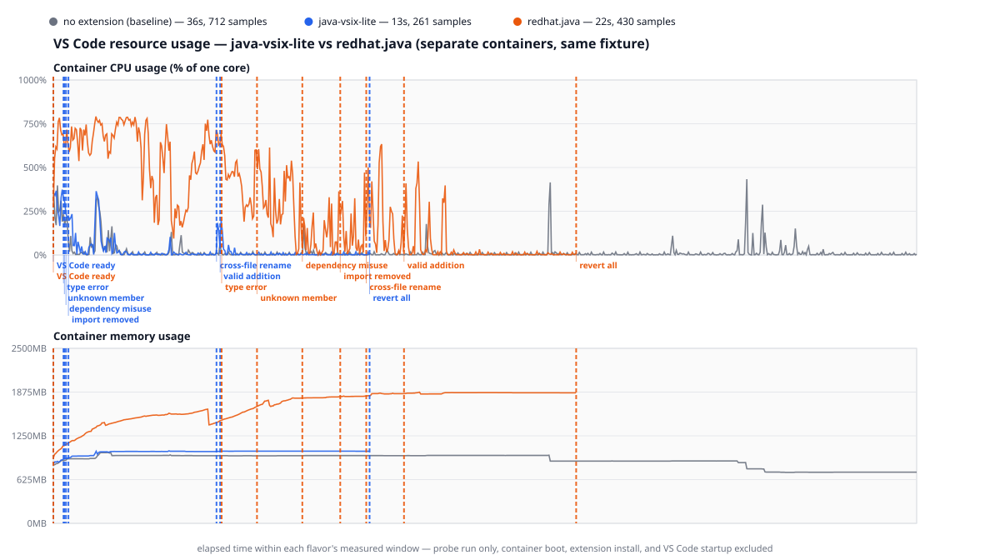

# java-vsix-lite

Fast, low-footprint Java language support for VS Code, powered by a pure-Rust language server that starts instantly and stays out of the way.

It targets everyday Java editing — highlighting, completion, navigation, diagnostics — without the memory and CPU cost of a full Eclipse JDT toolchain. It is not a replacement for [Language Support for Java by Red Hat](https://marketplace.visualstudio.com/items?itemName=redhat.java) on large, refactoring-heavy codebases; it trades exhaustive semantic analysis for a small, quick, secure default that covers the majority of day-to-day work.

The full feature list, settings, and security details live in the [VS Code extension README](editors/vscode/README.md).

## Performance

### Language server alone

On an Apple Silicon Mac, a release-build benchmark across five established small Maven projects (Spring PetClinic, Apache Commons CLI, Gson, Joda-Time, JUnit 4) compared a first-use workflow — fresh server start, readiness, diagnostics, JDK/project completions, and workspace symbols — against the full JDT server in Red Hat Java 1.55.0.

Across all measured runs the workflow averaged **≈163 ms and ≈19.6 MiB RSS** for java-vsix-lite versus **≈9.6 s and ≈937 MiB RSS** for Red Hat — roughly **59× faster and 48× lower-memory** for the shared operations tested. The installed payload is **≈4.1 MiB** versus **176 MiB**. These figures reflect lower cold-start, idle-memory, and basic-editing overhead; they are not a claim of feature parity. Full per-project results and methodology are in the [extension README](editors/vscode/README.md#measured-footprint).

### Inside VS Code

The [comparison harness](tools/vscode-compare/README.md) runs the same scripted session in a real VS Code three times, each in its own Docker container: once with java-vsix-lite 0.1.9, once with Red Hat's `redhat.java` 1.57.2026090408, and once with no Java extension, to measure what VS Code costs on its own. The project is a small Maven fixture, nine classes that use Guava and commons-lang3, so classpath resolution is part of what gets measured. Results from nine runs on Linux x86-64 (Fedora 44, Intel i7-1185G7 with 4 cores and 8 threads, 31 GiB, Docker 29.7.2, VS Code 1.137.0), shown as median [min–max]:

| | java-vsix-lite | redhat.java |
| --- | --- | --- |
| CPU time for the whole session | **10.5 core-s** [10.3–10.9] | 68.0 core-s [65.5–69.8] |
| Peak memory (whole container) | **1,043 MB** [1,026–1,072] | 1,868 MB [1,825–2,013] |
| Session length | **13.1 s** [13.0–13.7] | 21.6 s [21.4–21.9] |
| Language server ready | **36 ms** [23–77] | 5,950 ms [5,670–6,071] |

The memory figures include VS Code itself, which peaks at 1,009 MB with no extension installed. On top of that, java-vsix-lite adds about 34 MB and redhat.java about 860 MB. redhat.java also reached the machine's 8-thread CPU ceiling in about 4% of samples, and demand above the ceiling can't be measured, so its CPU figure is, if anything, low. Full numbers are in [`results/2026-09-12-linux-x64`](tools/vscode-compare/results/2026-09-12-linux-x64/aggregate.md).

*Run 1 of 9, the one closest to the medians. Gray is VS Code with no extension, blue is java-vsix-lite, orange is redhat.java. Dashed lines mark when VS Code became ready and each scripted edit. Time starts at the beginning of each session, so VS Code startup isn't shown.*

#### What the session tests

Each step either asks for one language feature or makes one edit to the fixture and waits for the plugin's verdict. An edit step passes only when the plugin reports an error that names the thing that was broken, so a stale or unrelated diagnostic can't count. Times are medians across the nine runs. An edit step's time also covers undoing the previous step's change and waiting for its errors to clear.

| Step | What it checks | java-vsix-lite | redhat.java |
| --- | --- | --- | --- |
| `server.ready` | Time until the server answers its first request, the outline of `Orders.java` | 36 ms | 5,950 ms |
| `diagnostics.clean` | The untouched project shows no errors | clean | clean |
| `symbols.orders` | The outline of `Orders.java` | 10 ms | 6 ms |
| `hover.total` | Hover over the call `orders.total()` in `Main.java` | 10 ms | 457 ms |
| `definition.total` | Go to definition from that call | 9 ms | 17 ms |
| `completion.orders` | Member completion after `orders.` | 11 ms | 236 ms |
| `edit.localTypeError` | `int sum` becomes `String sum` | 48 ms | 1,461 ms |
| `edit.unknownMember` | A call to `price()`, which `Order` doesn't have | 86 ms | 1,902 ms |
| `edit.dependencyMisuse` | A call to `ImmutableList.copyOfRange`, which Guava doesn't have; catching it needs the jar resolved | 99 ms | 1,049 ms |
| `edit.removedImport` | Delete the `ImmutableList` import; its uses must be flagged | **not flagged** | 1,044 ms |
| `edit.crossFileRename` | Rename `total()`; the error must appear in `Main.java`, the file that wasn't edited | 149 ms | 2,068 ms |
| `edit.validAddition` | Add a valid method; nothing may be reported | clean | clean |
| `edit.revertAll` | Restore both files; every error must clear | 39 ms | 50 ms |

Two results go against java-vsix-lite. After the import is deleted, it analyzes the file and reports no errors, in every run, while redhat.java reports the unresolved `ImmutableList`. Its completion list also offers the private fields `items` and `currency`, which `Main.java` can't use, and leaves out the members inherited from `Object`. redhat.java leaves out the private fields and includes the `Object` members.

A step that ends with nothing reported can only be judged after the plugin has been quiet for six seconds. Those steps are `edit.validAddition` for both plugins and `edit.removedImport` for java-vsix-lite, so they show an outcome instead of a time. The quiet periods account for about 12 of java-vsix-lite's 13.1 seconds of session length. The [harness README](tools/vscode-compare/README.md#probes) describes the method in full.

## How it works

A thin TypeScript client (the VS Code extension host is JavaScript-only) hosts commands and speaks LSP to a native server; all analysis happens in Rust across two tiers.

**Default tier — pure Rust, no JVM. Always on, runs in untrusted workspaces.**

- Incremental, error-tolerant parsing and semantic highlighting via `tree-sitter-java`.
- Structure, diagnostics, completion, hover, go-to-definition, find references, rename, call/type hierarchy, and code actions.
- Signature-level IntelliSense for JDK and dependency symbols by reading `.class` bytecode directly with [`cafebabe`](https://crates.io/crates/cafebabe) — types, methods, fields, and generic signatures, with no JVM and without executing any project code.
- Written in Rust with `#![forbid(unsafe_code)]`, which removes memory-safety attack classes when parsing untrusted source, bytecode, and archives.

**Compiler tier — optional `javac` diagnostics. Trusted workspaces only.**

- Runs the detected JDK's `javac` (annotation processing disabled with `-proc:none`) on project load and after saves, publishing real compiler errors to the Problems panel. There is no resident JVM — each run is a bounded, timeout-guarded, killable subprocess, debounced and silent.
- Automatic checks are **module-scoped**: a save compiles only the Maven/Gradle module(s) owning the changed file(s), not the whole workspace, so unrelated modules aren't recompiled every time (sibling-module sources still resolve via `-sourcepath`). The manual **Check Project (javac)** command remains a complete full-workspace check.
- The JDK is auto-detected (ranked by real feature version) and overridable in settings; the check compiles at the project's declared source level (falling back to the JDK's own) so preview syntax is not misreported.

## Build tooling

- Maven and Gradle classpaths are resolved **statically and offline** from `pom.xml` / `build.gradle(.kts)` / version catalogs and the local `~/.m2` and `~/.gradle` caches, transitive dependencies included, and re-resolved when build files change. Build scripts are never executed to do this.
- Missing dependencies can be fetched from Maven Central or a configured internal repository (HTTPS with checksum verification, consent-gated), or populated by an explicit **Install Dependencies** command that runs the project's own `mvn`/`gradle` — only in a trusted workspace, with per-run confirmation.

## Security

- **Build scripts are never executed** implicitly or in the background; anything that runs them is explicit, per-run consented, and disabled in untrusted workspaces. VS Code Workspace Trust is honored throughout.
- **No network access without consent.** Dependency download is the only outbound path, is opt-in, and everything fetched is HTTPS + checksum-verified and never executed.
- **`javac` always runs with `-proc:none`**, so annotation processors — arbitrary code — never run.
- **Robust against malformed input**: no XXE in XML, no zip-slip or path traversal on archives, and bounded allocations on untrusted archives and files.
- **Machine-scoped tool paths.** The JDK, `mvn`/`gradle`, server binary, and download repository can only be set from user/machine settings, so a workspace can never redirect which binary is launched on your behalf.

## Repository layout

| Crate / directory | Responsibility |
| --- | --- |
| `crates/syntax` | IO-free analysis over the tree-sitter tree — the default tier's language features |
| `crates/classpath` | Bytecode, archive, JDK, and build-file reading (no JVM) |
| `crates/server` | The `tower-lsp` language-server binary |
| `editors/vscode` | The VS Code extension — a thin TypeScript LSP client |

## Building

Requires the Rust toolchain and Node.js 20 or newer. From `editors/vscode`, `npm run package:vsix` builds the release server, bundles it into the extension, and produces a platform-specific `.vsix` (failing if the native server is missing). See the [extension README](editors/vscode/README.md#building-from-source) for details.

## License

MIT — see the [LICENSE](LICENSE) file.
